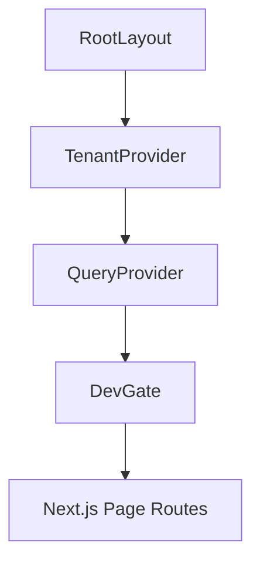

# FRONTEND_WIRING_RENDER_MAP — Frontend Architecture Map

This document details the bootstrap composition, routing structures, rendering patterns, data fetching, and state management flow of the Agency-OS frontend web application.

---

## 1. App Bootstrap & Provider Tree

The root React provider tree is established inside [layout.tsx](../../control-plane/web/src/app/layout.tsx):



### Context & Provider Responsibilities:
1. **`TenantProvider`** ([TenantContext.tsx](../../control-plane/web/src/contexts/TenantContext.tsx)):
   - Loads the active `tenantId`, `activeBrandId`, user `role`, and `operatorToken` from `localStorage` on client boot (wrapped in `useEffect` to prevent server-side hydration mismatches).
   - Syncs and pulls the complete registry of `knownTenants` from the backend `GET /tenants` on mount.
   - Automatically propagates state updates to the rest of the application.
2. **`QueryProvider`** ([QueryProvider.tsx](../../control-plane/web/src/providers/QueryProvider.tsx)):
   - Instantiates a TanStack `@tanstack/react-query` `QueryClient` client-side.
   - Default configurations:
     - `staleTime: 60000` (60 seconds)
     - `refetchOnWindowFocus: false` (avoids triggering excessive background API requests on window focus changes).
3. **`DevGate`** ([DevGate.tsx](../../control-plane/web/src/components/DevGate.tsx)):
   - Development-level route guard.
   - If not authenticated/entered, blocks dashboard views and displays a developer bypass login card (inputs for Tenant ID and Role Authority selection).
   - Once submitted, saves to `localStorage` and exposes a top development bar showing the active context configuration.

---

## 2. Page & Route Tree layout

All dashboard views are grouped under the `(dashboard)` route group layout ([layout.tsx](../../control-plane/web/src/app/(dashboard)/layout.tsx)) which defines the main UI shell (Header context selector, Operator Actions panel sidebar, and Tab navigation):

```
/src/app/
├── layout.tsx                              # Root Layout (Root providers + HTML wrapper)
├── page.tsx                                # Root landing route (redirects or landing)
└── (dashboard)/
    ├── layout.tsx                          # Dashboard shell (Sidebar action panel + Top tab navigation + Drawer integration)
    ├── ops/
    │   └── page.tsx                        # Operations Queue (GET /ops, POST /ops/{op_id}/decision)
    ├── connections/
    │   └── page.tsx                        # Connections directory & active list (GET /connections, GET /actions/catalog)
    ├── audit/
    │   └── page.tsx                        # Cryptographic audit log viewer (GET /audit, GET /audit/verify)
    ├── safety/
    │   └── page.tsx                        # Circuit Breakers list (GET /circuit-breakers, POST /circuit-breakers/toggle)
    ├── twin/
    │   └── page.tsx                        # Brand Twin organic crawler gap report (GET /brands/{brand_id}/graph)
    └── poas/
        └── page.tsx                        # POAS Analytics dashboards (GET /brands/{brand_id}/poas)
```

---

## 3. Data Fetching & Sync State Pattern

### 3.1 Fetch Hook (`useApi`)
Frontend services fetch data from the FastAPI backend using the custom React hook `useApi` ([api-client.ts](../../control-plane/web/src/lib/api-client.ts)):
- Automatically loads variables `tenantId` and `operatorToken` from `useTenant()`.
- Prepends API requests with:
  - Header `X-Tenant-ID`: `<tenantId>`
  - Header `Authorization`: `Bearer <operatorToken>` (if configured)
  - Header `Content-Type`: `application/json`
- Evaluates HTTP response statuses. If `!res.ok`, extracts the JSON error message detail (`errBody.detail`) and raises a JavaScript exception.

### 3.2 Synchronization & Polling Behaviors
- **Operations Queue (`ops/page.tsx`)**: Refetches the operations list via React Query every 5 seconds (`refetchInterval: 5000`).
- **Circuit Breaker Status (`layout.tsx` / `safety/page.tsx`)**: Monitored in the background and polled every 5 seconds to toggle the top tripped warning alert banner.
- **Connections List (`connections/page.tsx`)**: Polled every 10 seconds.
- **Audit Verification Status (`layout.tsx`)**: Refetches the tamper-evident validation results (`GET /audit/verify`) every 10 seconds.

---

## 4. Render Mode & Hydration Guardrails

- **Render Mode**: All client views use Next.js `"use client"` directive, meaning they render primarily client-side (CSR).
- **SSR Hydration Protection**: To prevent Next.js SSR-vs-CSR mismatch warnings when pulling settings from `localStorage` on boot, state variables are read inside `useEffect` (client-side only execution phase).
- **Operation Detail Drawer Context Integration**: Clicking an operation row in the table (`ops/page.tsx`) pushes the operation ID into the browser's URL search parameters (`?opId=<op_id>`). The layout shell detects the change, queries the detail payload via React Query, and renders the `OpDetailDrawer` (sliding drawer) dynamically.
- **Actions Catalogue Integration**: The sidebar action panel (`ActionPanel.tsx`) and the connections catalog (`connections/page.tsx`) retrieve their list of available actions from `GET /actions/catalog` and present form modal triggers. The actual trigger proposing is sent via `POST /actions`, returning a list of proposed Ops.
